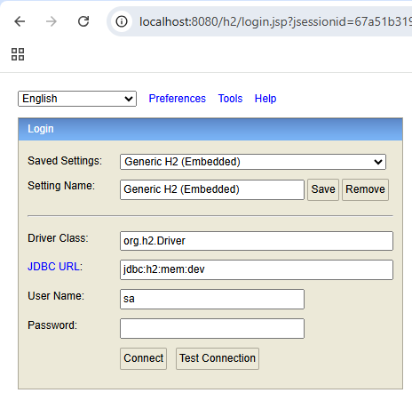
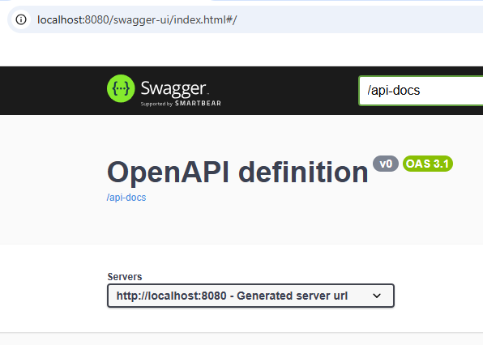

# Exchange Rates API

## Technologies
1. [Maven](https://maven.apache.org/) used as a build tool and for dependency management.  
Configured via [pom.xml](pom.xml)
2. [Spring Boot/MVC](https://spring.io/projects/spring-boot).  
- `server.port` is set to `8080`, and spring boot app accessible at [localhost:8080](http://localhost:8080)
- Configuration via - [application.yml](src/main/resources/application.yml).  
- Tests configuration at [application-test.yml](src/test/resources/application.yml)
3. [OpenFeign](https://spring.io/projects/spring-cloud-openfeign) is used for defining annotation driven declarative HTTP (RESTful) clients.
4. [H2](https://www.h2database.com/html/main.html) in memory relation database. ORM in use is Hibernate.  
H2 Console is available and can be accessed in the following manner:  
JDBC url: `jdbc:h2:mem:dev`  
Username: `sa`  
Password:  
  
URL: [http://localhost:8080/h2/login.jsp](http://localhost:8080/h2/login.jsp)  
5. [SpringDocs](https://springdoc.org/) is used for Rest API docs and testing.  
  
URL: [http://localhost:8080/swagger-ui/index.html](http://localhost:8080/swagger-ui/index.html)
6. [Liquibase](https://www.liquibase.com/) is used for database schema change management.
7. [MapStruct](https://mapstruct.org/) is used for defining annotation driven declarative Mappers, e.g. mapping layers like `dto` <-> `entity`.
8. [Lombok](https://projectlombok.org/) is used for generating boilerplate functionality for POJOs and Objects, e.g. getters, setters, constructors.
9. [WireMock](https://wiremock.org/) is used for mocking HTTP client behaviour in test environments.
## Functionality
There are two APIs provided by the service.

1. `Currency API` that is serving information regarding known(supported) currencies and currency exchange rates. Relative path: `/currency`  
[Conversion Controller swagger-ui](http://localhost:8080/swagger-ui/index.html#/conversion-controller/)
2. `Conversion API` that is enabling end users to convert currency in real time. Any conversion history is being stored and accessible on demand.  
[Exchange Rates Controller swagger-ui](http://localhost:8080/swagger-ui/index.html#/exchange-rates-controller/)

#### 3rd Party Currency Exchange Rates provider - Free Currency Conversion API
Currently `Free Currency Conversion API` is used as exchange rates provider.  
Useful links:  
[FreeCurrencyAPI Error Codes](https://freecurrencyapi.com/docs/status-codes#api-error-codes)  
[FreeCurrencyAPI Authentication](https://freecurrencyapi.com/docs/#authentication-methods)  
[FreeCurrencyAPI Currency List](https://freecurrencyapi.com/docs/currency-list)  
Currently supported currencies by the service mirror the list provided by `FreeCurrencyAPI` yet current implementation will notify the user if any of the currencies is no longer supported by the provider.